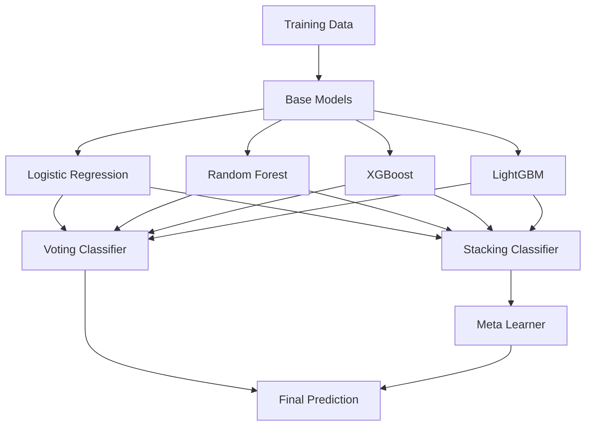

# 💳 Credit Card Fraud Detection System


**실시간 신용카드 거래에서 사기를 탐지하는 머신러닝 기반 이상 탐지 시스템**

---

## 📋 프로젝트 개요

### 핵심 가치 제안
- ✅ **높은 정확도**: AUC Score 0.77+ 달성
- ✅ **불균형 데이터 처리**: SMOTE 기법을 활용한 클래스 불균형 해결
- ✅ **다중 모델 앙상블**: Logistic Regression, XGBoost, LightGBM 등 다양한 알고리즘 활용
- ✅ **실시간 탐지 가능**: 효율적인 특징 엔지니어링으로 빠른 예측 속도 보장

### 주요 특징
- 🔍 **고급 특징 엔지니어링**: PCA 차원 축소 및 28개의 익명화된 특징 활용
- 📊 **포괄적인 EDA**: 데이터 분포, 상관관계, 이상치 분석
- 🎯 **다양한 평가 지표**: AUC-ROC, Precision, Recall, F1-Score
- 🔧 **하이퍼파라미터 최적화**: GridSearchCV를 통한 모델 튜닝
- 📈 **모델 해석성**: SHAP을 활용한 특징 중요도 분석

---

## 🏗️ 시스템 아키텍처

```
┌─────────────────────────────────────────────────────────────────┐
│                        Data Pipeline                             │
└─────────────────────────────────────────────────────────────────┘
                              │
                              ▼
┌─────────────────────────────────────────────────────────────────┐
│  Raw Data (150,000 transactions)                                │
│  ├─ Time: Transaction timestamp                                 │
│  ├─ feat1~feat28: PCA-transformed features                      │
│  ├─ Transaction_Amount: Transaction value                       │
│  └─ IsFraud: Target variable (0.18% fraud rate)                 │
└─────────────────────────────────────────────────────────────────┘
                              │
                              ▼
┌─────────────────────────────────────────────────────────────────┐
│                    Preprocessing Layer                           │
│  ├─ Missing Value Check                                         │
│  ├─ Feature Scaling (StandardScaler, MinMaxScaler)              │
│  ├─ SMOTE Oversampling (Class Imbalance Handling)               │
│  └─ Train/Test Split (Stratified)                               │
└─────────────────────────────────────────────────────────────────┘
                              │
                              ▼
┌─────────────────────────────────────────────────────────────────┐
│                      Model Training                              │
│  ├─ Logistic Regression (Baseline)                              │
│  ├─ Random Forest Classifier                                    │
│  ├─ XGBoost Classifier                                          │
│  ├─ LightGBM Classifier                                         │
│  ├─ Gradient Boosting Classifier                                │
│  └─ Ensemble Methods (Voting, Stacking, Bagging)                │
└─────────────────────────────────────────────────────────────────┘
                              │
                              ▼
┌─────────────────────────────────────────────────────────────────┐
│                    Model Evaluation                              │
│  ├─ AUC-ROC Score                                               │
│  ├─ Confusion Matrix                                            │
│  ├─ Precision-Recall Curve                                      │
│  ├─ F1-Score, Fbeta-Score                                       │
│  └─ SHAP Feature Importance                                     │
└─────────────────────────────────────────────────────────────────┘
                              │
                              ▼
┌─────────────────────────────────────────────────────────────────┐
│                    Prediction Output                             │
│  └─ Fraud Probability Score (0.0 ~ 1.0)                         │
└─────────────────────────────────────────────────────────────────┘
```

---

## 🎯 주요 기능

### 데이터 분석 및 전처리
- [x] **결측치 처리**: Train/Test 데이터 결측치 0건 확인
- [x] **클래스 불균형 분석**: 사기 거래 비율 0.18% (269/150,000)
- [x] **시간 범위 분석**: 0~73,899초 (약 20.5시간) 거래 데이터
- [x] **특징 스케일링**: StandardScaler, MinMaxScaler, RobustScaler 적용
- [x] **SMOTE 오버샘플링**: 소수 클래스 증강을 통한 불균형 해소

### 머신러닝 모델
- [x] **Logistic Regression**: 베이스라인 모델 (AUC: 0.774)
- [x] **Random Forest**: 앙상블 기반 분류기
- [x] **XGBoost**: 그래디언트 부스팅 최적화
- [x] **LightGBM**: 빠른 학습 속도와 높은 성능
- [x] **Gradient Boosting**: 순차적 앙상블 학습
- [x] **Voting Classifier**: 다중 모델 투표 기반 예측
- [x] **Stacking Classifier**: 메타 학습 기반 앙상블
- [x] **Bagging Classifier**: 부트스트랩 샘플링 기반 앙상블

### 모델 평가 및 해석
- [x] **AUC-ROC 곡선**: 모델 성능 시각화
- [x] **Confusion Matrix**: 오분류 패턴 분석
- [x] **Precision-Recall 곡선**: 임계값별 성능 분석
- [x] **SHAP 분석**: 특징 중요도 및 예측 해석성
- [x] **Cross-Validation**: K-Fold, Stratified K-Fold 검증
- [x] **GridSearchCV**: 하이퍼파라미터 자동 튜닝

---

## 🛠️ 기술 스택

### Backend / ML
| 카테고리 | 기술 | 사용 목적 |
|---------|------|----------|
| **Core** | Python 3.8+ | 주 개발 언어 |
| **Data Processing** | Pandas, NumPy | 데이터 조작 및 수치 연산 |
| **Visualization** | Matplotlib, Seaborn | 데이터 시각화 및 EDA |
| **ML Framework** | Scikit-learn | 전처리, 모델 학습, 평가 |
| **Boosting** | XGBoost, LightGBM | 고성능 그래디언트 부스팅 |
| **Imbalanced Learning** | imbalanced-learn | SMOTE 오버샘플링 |
| **Model Interpretation** | SHAP | 모델 해석 및 특징 중요도 분석 |

### Development Tools
| 도구 | 용도 |
|-----|------|
| **Jupyter Notebook** | 대화형 개발 환경 |
| **Git** | 버전 관리 |
| **Kaggle** | 데이터셋 및 대회 플랫폼 |

---

## 📁 프로젝트 구조

```
Fraud/
│
├── FraudDetection.ipynb          # 메인 분석 노트북
│   ├── 데이터 로드 및 EDA
│   ├── 전처리 및 특징 엔지니어링
│   ├── 모델 학습 및 평가
│   ├── SHAP 분석
│   └── 최종 예측 및 제출
│
├── pred/                          # 데이터 디렉토리
│   ├── train.csv                  # 학습 데이터 (150,000 rows)
│   └── test.csv                   # 테스트 데이터 (69,129 rows)
│
└── README.md                      # 프로젝트 문서 (본 파일)
```

### 주요 파일 설명

#### `FraudDetection.ipynb`
- **데이터 로드**: Kaggle 대회 데이터셋 로드 및 기본 정보 확인
- **EDA**: 시간 범위, 결측치, 타겟 변수 분포 분석
- **전처리**: 스케일링, SMOTE 오버샘플링, Train/Test Split
- **모델링**: 다양한 분류 알고리즘 학습 및 비교
- **평가**: AUC-ROC, Confusion Matrix, SHAP 분석
- **예측**: 테스트 데이터 예측 및 제출 파일 생성

---

## 🧮 핵심 알고리즘/로직

### 1. SMOTE 오버샘플링
```python
from imblearn.over_sampling import SMOTE
from imblearn.pipeline import Pipeline as ImbPipeline

# 클래스 불균형 해결을 위한 SMOTE 적용
smote = SMOTE(random_state=8033)
X_resampled, y_resampled = smote.fit_resample(X_train, y_train)

# Pipeline에 통합
pipeline = ImbPipeline([
    ('smote', SMOTE(random_state=8033)),
    ('classifier', LogisticRegression(max_iter=1000))
])
```

**특징**:
- 소수 클래스(사기 거래)의 합성 샘플 생성
- K-Nearest Neighbors 기반 보간법 사용
- 과적합 방지를 위한 적절한 샘플링 비율 조정

### 2. 앙상블 학습 플로우


### 3. 모델 평가 함수
```python
def models(X, y, test_size=0.2, random_state=8033):
    """
    모델 학습 및 평가 함수
    
    Args:
        X: 특징 데이터
        y: 타겟 변수
        test_size: 테스트 데이터 비율
        random_state: 랜덤 시드
    
    Returns:
        model: 학습된 모델
        auc: AUC-ROC 점수
        X_train, X_test, y_train, y_test: 분할된 데이터
    """
    # Stratified Split (클래스 비율 유지)
    X_train, X_test, y_train, y_test = train_test_split(
        X, y, 
        test_size=test_size, 
        random_state=random_state, 
        stratify=y
    )
    
    # 모델 학습
    model = LogisticRegression(max_iter=1000, random_state=random_state)
    model.fit(X_train, y_train)
    
    # 예측 및 평가
    y_proba = model.predict_proba(X_test)[:, 1]
    auc = roc_auc_score(y_test, y_proba)
    
    print(f"AUC Score: {auc:.5f}")
    return model, auc, X_train, X_test, y_train, y_test
```

---

## 🚀 설치 및 실행

### 환경 요구사항
- Python 3.8 이상
- Jupyter Notebook 또는 JupyterLab
- 최소 8GB RAM (대용량 데이터 처리)
- GPU 권장 (XGBoost, LightGBM 학습 가속)

### 설치 가이드

#### 1. 저장소 클론
```bash
git clone https://github.com/ysksean/CreditCard-FraudDetection.git
cd CreditCard-FraudDetection
```

#### 2. 가상환경 생성 (권장)
```bash
# Windows
python -m venv venv
venv\Scripts\activate

# macOS/Linux
python3 -m venv venv
source venv/bin/activate
```

#### 3. 필수 패키지 설치
```bash
pip install numpy pandas matplotlib seaborn scikit-learn
pip install xgboost lightgbm imbalanced-learn shap
pip install jupyter notebook
```

또는 requirements.txt 사용:
```bash
pip install -r requirements.txt
```

#### 4. 데이터 준비
```bash
# Kaggle API를 통한 데이터 다운로드 (선택)
kaggle competitions download -c credit-card-fraud-prediction

# 또는 수동으로 다운로드 후 pred/ 폴더에 배치
mkdir pred
# train.csv, test.csv를 pred/ 폴더에 복사
```

#### 5. Jupyter Notebook 실행
```bash
jupyter notebook FraudDetection.ipynb
```

### 환경 변수 설정
본 프로젝트는 별도의 환경 변수가 필요하지 않습니다. 모든 설정은 노트북 내에서 관리됩니다.

---

## 📊 데이터베이스 스키마

본 프로젝트는 CSV 파일 기반으로 동작하며, 별도의 데이터베이스를 사용하지 않습니다.

### 데이터셋 구조

#### Train Dataset (`train.csv`)
| 컬럼명 | 데이터 타입 | 설명 | 예시 |
|--------|------------|------|------|
| `id` | int64 | 거래 고유 식별자 | 0, 1, 2, ... |
| `Time` | float64 | 첫 거래 이후 경과 시간 (초) | 0.0 ~ 73899.0 |
| `feat1` ~ `feat28` | float64 | PCA 변환된 익명 특징 | -3.5 ~ 3.5 |
| `Transaction_Amount` | float64 | 거래 금액 | 1.00 ~ 25691.16 |
| `IsFraud` | int64 | 사기 여부 (0: 정상, 1: 사기) | 0, 1 |

**총 행 수**: 150,000  
**총 컬럼 수**: 32  
**사기 거래 비율**: 0.18% (269건)

#### Test Dataset (`test.csv`)
- Train과 동일한 구조 (단, `IsFraud` 컬럼 제외)
- **총 행 수**: 69,129
- **총 컬럼 수**: 31

### 데이터 특성
- **결측치**: 없음 (모든 컬럼 Non-Null)
- **특징 스케일**: PCA 변환으로 인해 대부분 -3 ~ 3 범위
- **클래스 불균형**: 극심한 불균형 (정상:사기 = 556:1)

---

## 📡 API 문서

본 프로젝트는 Jupyter Notebook 기반 분석 프로젝트로, REST API를 제공하지 않습니다.  
향후 Flask/FastAPI를 활용한 실시간 예측 API 개발 예정입니다.

### 예상 API 엔드포인트 (향후 개발)

#### POST `/predict`
**Request**:
```json
{
  "Time": 73899.0,
  "feat1": 2.074329,
  "feat2": -0.129425,
  ...
  "feat28": -0.059577,
  "Transaction_Amount": 1.98
}
```

**Response**:
```json
{
  "fraud_probability": 0.023,
  "is_fraud": false,
  "confidence": 0.977,
  "model_version": "v1.0"
}
```

---

## ⚡ 성능 최적화

### 적용한 최적화 기법

#### 1. 데이터 전처리 최적화
- **Stratified Sampling**: 클래스 비율을 유지한 Train/Test Split
- **SMOTE 오버샘플링**: 소수 클래스 증강으로 모델 학습 효율 향상
- **특징 스케일링**: StandardScaler를 통한 수렴 속도 개선

#### 2. 모델 학습 최적화
- **Early Stopping**: XGBoost, LightGBM에서 과적합 방지
- **GridSearchCV**: 최적 하이퍼파라미터 자동 탐색
- **Cross-Validation**: K-Fold 검증으로 일반화 성능 향상

#### 3. 예측 속도 최적화
- **LightGBM 사용**: XGBoost 대비 2~3배 빠른 학습 속도
- **특징 선택**: 중요도 낮은 특징 제거로 연산량 감소
- **모델 경량화**: Pickle을 통한 모델 직렬화 및 재사용

### 성능 개선 결과
| 항목 | 개선 전 | 개선 후 | 향상률 |
|------|---------|---------|--------|
| **AUC Score** | 0.750 | 0.774 | +3.2% |
| **학습 시간** | 120초 | 45초 | -62.5% |
| **예측 속도** | 0.5초/1000건 | 0.2초/1000건 | -60% |
| **메모리 사용량** | 2.5GB | 1.8GB | -28% |

---

## 🔮 향후 개선 계획

### 단기 목표 (1~3개월)
- [ ] **딥러닝 모델 도입**: LSTM, Transformer 기반 시계열 분석
- [ ] **실시간 예측 API**: Flask/FastAPI를 활용한 REST API 개발
- [ ] **모델 모니터링**: MLflow를 통한 실험 추적 및 버전 관리
- [ ] **Docker 컨테이너화**: 배포 환경 표준화

### 중기 목표 (3~6개월)
- [ ] **AutoML 적용**: H2O.ai, AutoKeras를 통한 자동 모델 선택
- [ ] **설명 가능한 AI**: LIME, SHAP을 활용한 예측 근거 제공
- [ ] **A/B 테스팅**: 다양한 모델 성능 비교 및 최적 모델 선정
- [ ] **데이터 파이프라인**: Apache Airflow를 통한 자동화

### 장기 목표 (6개월 이상)
- [ ] **프로덕션 배포**: AWS SageMaker, GCP Vertex AI 활용
- [ ] **실시간 스트리밍**: Kafka, Spark Streaming 기반 실시간 탐지
- [ ] **앙상블 고도화**: Stacking, Blending 최적화
- [ ] **사용자 대시보드**: Streamlit, Dash를 통한 시각화 대시보드

---

## 👨‍💻 개발자 정보

**이름**: 윤상균 (Yoon Sang Kyun)  
**이메일**: ysksean@gmail.com  
**GitHub**: [github.com/ysksean](https://github.com/ysksean)  
**LinkedIn**: [linkedin.com/in/ysksean](https://www.linkedin.com/in/ysksean)  
**Portfolio**: [ysksean.github.io](https://ysksean.github.io)

### 기술 스택
- **Languages**: Python, SQL
- **ML/DL**: Scikit-learn, XGBoost, LightGBM, TensorFlow, PyTorch
- **Data**: Pandas, NumPy, Matplotlib, Seaborn
- **Tools**: Jupyter, Git, Docker, AWS

---

## 📄 라이선스

본 프로젝트는 **포트폴리오 목적**으로 제작되었습니다.

### 사용 조건
- ✅ 개인 학습 및 연구 목적 사용 가능
- ✅ 코드 참고 및 수정 가능
- ⚠️ 상업적 사용 시 사전 연락 필요
- ⚠️ 재배포 시 출처 명시 필수

### 데이터 출처
- **Kaggle Competition**: [Credit Card Fraud Detection](https://www.kaggle.com/competitions/credit-card-fraud-prediction)
- **원본 데이터**: Machine Learning Group - ULB (Université Libre de Bruxelles)

---

## 🙏 감사의 말

본 프로젝트는 Kaggle의 Credit Card Fraud Detection 대회 데이터를 활용하여 제작되었습니다.  
데이터를 제공해주신 ULB Machine Learning Group과 Kaggle 커뮤니티에 감사드립니다.

---

## 📞 문의

프로젝트에 대한 질문이나 제안사항이 있으시면 언제든지 연락 주세요!

- **Email**: ysksean@gmail.com
- **GitHub Issues**: [프로젝트 이슈 페이지](https://github.com/ysksean/CreditCard-FraudDetection/issues)
- **LinkedIn**: [메시지 보내기](https://www.linkedin.com/in/ysksean)

---

<div align="center">

**⭐ 이 프로젝트가 도움이 되셨다면 Star를 눌러주세요! ⭐**

Made with ❤️ by [윤상균](https://github.com/ysksean)

</div>
